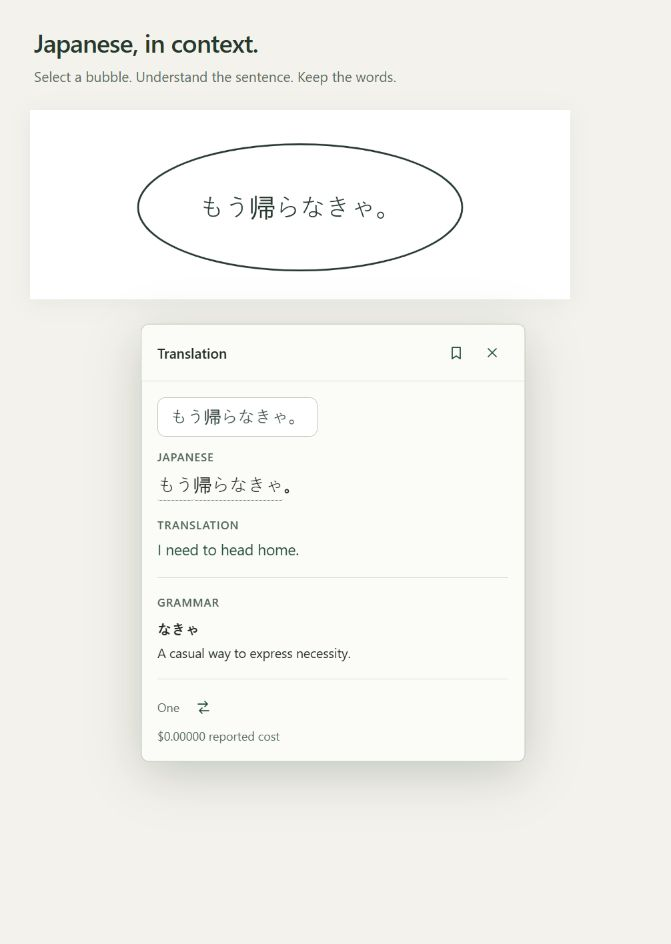
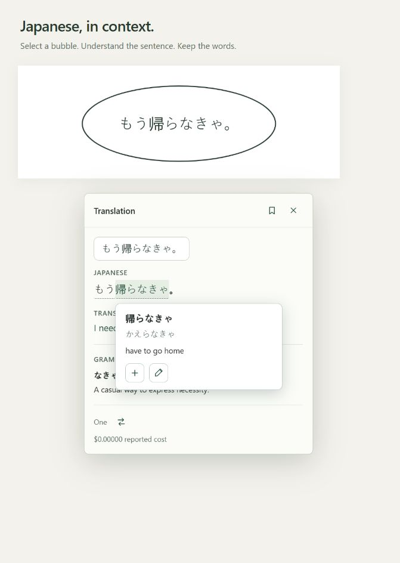
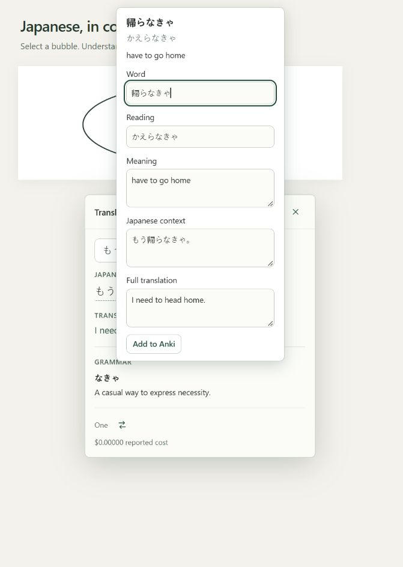

# Manga Reading Assistant

**Read Japanese manga. Understand the sentence. Keep the words.**

Select a speech bubble to see its Japanese text, English translation, word readings and meanings, and grammar points—all alongside your book. Save vocabulary to Anki with the original sentence and full translation.

Built for **desktop Firefox**, with Japanese-to-English reading on **BookWalker**, including continuous scrolling. Other reading sites may work; support depends on the site's reader.

[See it in action](#see-it-in-action) · [Install](#install) · [Set up](#first-time-setup) · [Anki guide](docs/anki-mining.md)

## See it in action

### 1. Select a bubble and read its translation

Press **Alt+Q**, drag around the text, and release. Japanese, English, and grammar appear together. Keep scrolling while the translation finishes; drag the card's header to move it out of your way.

### 2. Explore a word and save it to Anki

Hover over Japanese for its reading and meaning. **Click the word to pin its popup**, then use **+** to add it to Anki or the **pencil** to edit first. The sentence and full translation come with it.

*Screenshots show the extension UI with sample dialogue and simulated responses. The displayed cost is demo data.*

## Install

**Public Firefox release: coming soon.** Installation will be through Mozilla Add-ons using **Add to Firefox**. The listing link will appear here when it is available.

Requires **Firefox 140 or newer on desktop**. Chrome and mobile browsers are not supported. To try the source before publication, follow the [temporary installation guide](docs/development.md#load-the-extension-in-firefox).

## First-time setup

1. **Create an OpenRouter key.** Sign in to [OpenRouter](https://openrouter.ai/settings/keys), add credit as needed, and create a dedicated API key with a spending limit.
2. **Connect the extension.** Open Manga Reading Assistant from Firefox's toolbar, choose **Get started**, and save your key.
3. **Choose a model.** Start with **Gemini 3 Flash** for learner explanations or **Gemini 3.1 Flash-Lite** for lower cost and shorter waits. Prices refresh when you open model selection.
4. **Connect Anki—or skip it.** With Anki Desktop and [AnkiConnect](https://ankiweb.net/shared/info/2055492159) running, choose your deck, note type, and field mapping. You can set this up later in Settings. [Detailed Anki setup →](docs/anki-mining.md)

Open BookWalker or another reading site, press **Alt+Q**, and select your first bubble.

## Reading controls

| What you want to do | How |
| --- | --- |
| Translate a selection | Press **Alt+Q**, drag around the text, and release |
| Open saved translations | Press **Alt+Q again while selecting**, or click the card's bookmark icon |
| Start another selection | Press **Alt+Q** while a translation or saved list is open |
| Keep word help open | Click the Japanese word |
| Move the card | Drag its header; its position is remembered |
| Close the reader UI | Press **Esc**; pending translations keep running |
| Change model or shortcut | Open the extension's toolbar settings |

Saved translations reopen over your current reading position. Opening them, viewing word help, and adding words to Anki do not make another translation request. Saved history is stored locally and has a size limit.

## Costs and privacy

The extension is free; **translation usage is billed separately to your OpenRouter account**. Cost depends on the chosen model, image size, and answer length. Prices shown per token are not fixed prices per translation. Failed requests may still incur charges, and retrying is always your choice.

Only the selected screenshot crop is sent to OpenRouter and a model provider. Keys, settings, and saved translations stay in Firefox on your device; there is no developer-operated server or analytics. Saved keys are not encrypted by the extension, so use a trusted computer account and a key with a spending limit. [Read the privacy policy →](PRIVACY.md)

Translations and word explanations can be wrong. Review vocabulary before adding it to your deck; the Anki editor lets you make corrections. See the [model comparison](docs/model-benchmark-broader-2026-09-25.md) for the small-sample evidence behind the suggestions.

## Help and contributing

[Report a problem](https://github.com/Vidoodle/manga-translation-extension/issues) with your Firefox and extension versions and steps to reproduce. Never include API keys or private captures.

[Developer guide](docs/development.md) · [Changelog](CHANGELOG.md) · [MIT license](LICENSE)

An independent project, unaffiliated with BookWalker, OpenRouter, Anki, or Mozilla.
